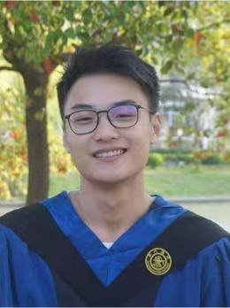

<main class="container">

# Recent Advances in Retrieval-Augmented Text Generation

#### 90-Minute Tutorial @ [IJCAI Conference 2022](https://ijcai-22.org/tutorials/).

## Overview

Recently, retrieval-augmented text generation has achieved state-of-the-art performance in many NLP tasks and attracted increasing attention of the computational linguistics community. Since retrieval-augmented generation is distributed in many sub-domains of information retrieval and text generation, it increases the difficulty for newcomers to get started. Therefore, this tutorial aims to introduce recent advances in retrieval-augmented text generation. It firstly highlights the generic paradigm of retrieval-augmented generation, and then it reviews notable approaches according to different tasks including dialogue generation, machine translation, and other generation tasks. Finally, it points out some limitations and shortcomings for recent approaches to facilitate future research.

## Materials

### Tutorial Overview

[Overview](assets/IJCAI_2022.pdf)

### Slides

[Part 1: Introduction to Retrieval-Augmented Text Generation](assets/slides/Part-1.pdf)

[Part 2: Retrieval-Augmented Dialogue Generation](assets/slides/Part-2.pdf)

[Part 3: Translation Memory augmented Neural Machine Translation](assets/slides/Part-3.pdf)

[Part 4: Translation Memory augmented Neural Machine Translation](assets/slides/Part-4.pdf)

## Organizers

##### [Deng Cai](https://jcyk.github.io/)

The Chinese University of Hong Kong

##### [Yan Wang](https://libertywing.github.io/yanwang.github.io/)

Tencent AI Lab

##### [Lemao Liu](https://lemaoliu.github.io/homepage/)

Tencent AI Lab

##### [Shuming Shi](https://scholar.google.co.jp/citations?user=Lg31AKMAAAAJ&hl=en)

Tencent AI Lab

</main>
